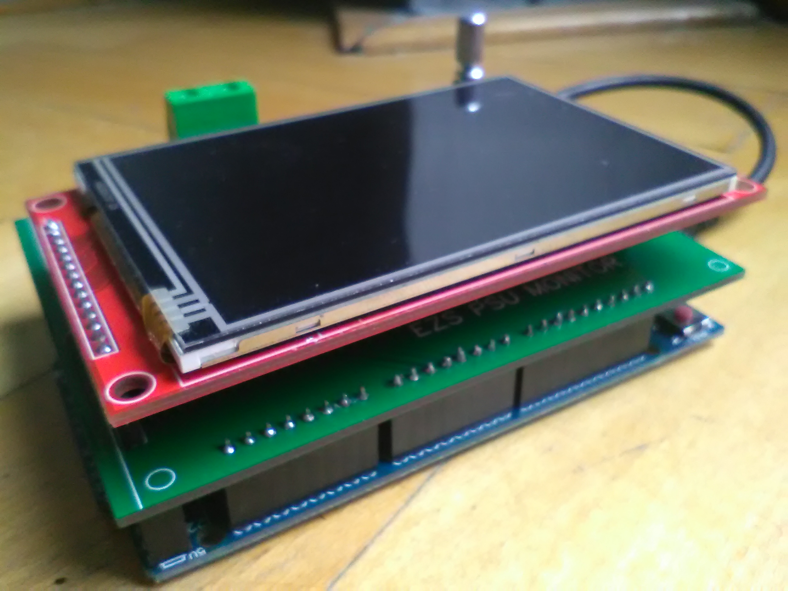

# Diploma Thesis: A Module for Power Supply Analysis of Electronic Security Systems



## Description
This repository deals with the design, construction and code of a module for monitoring and analysis of power supplies of electronic security systems. The module measures voltage, current, power and consumption. It logs the measurements to an SD card and displays the data on LCD. The Module lets user set maximum and minimum allowed voltage and current. If measured values are higher or lower than set tresholds the displayed values change color accordingly to notify the user. The information is logged aswell.


In the default configuration module can measure voltage up to 16 V and current up to 20 A. However, It is possible to change it according to your need. You can do that with simple hardware change of ration of voltage divider in the voltage/current measurement circuit followed up by a change of their coresponding values in a json config file. User can also set measuring frequency, calibration, display rotation and much more via build in menu system or through the config. If there is interest for more thorough description on how to do this, let me know and I will consider adding it.


The diploma thesis itself includes:
* A general division and description of power supplies.
* A reconnaissance of the market of power supplies intended for powering electronic security systems.
* A design and specification of requirements for the module.
* A choice of method of voltage and current measurements.
* A choice of components.
* A PCB design.
* A description of problems associated with the construction of the module and their solutions.
* A general design of the algorithm and description of the code.
* Series of measurements verifying functionality of the module and its compliance with the requirements set in the design.

This repository includes all necessary source code, schematics, gerber files of the board and the diploma thesis itself.


## Usage
**TODO: Add usage, pics, videos, etc.**

## Installation
To be able to use this project right away with all its blows and whistles you will need working [Visual Studio Code IDE](https://code.visualstudio.com/) with [Platformio](https://platformio.org/) extension and [Arduino IDE](https://www.arduino.cc/en/software). Easy to follow list of required software and libraries is at [Requirements](#requirements). It is possible to use this project in vanila Arduino IDE or other IDEs, however you will need to do some extra work to get it working.

1. Clone thi repo with `git clone https://github.com/SimonBrazda/Diploma_thesis-ESS_PSU_Monitor` or download the zip file.

### VS Code & PlatformIO
2. Install [VS Code](https://code.visualstudio.com/Download).
3. Install [Arduino IDE](https://www.arduino.cc/en/software).
4. Install [Platformio](https://platformio.org/platformio-ide).
5. Open VS Code in the projects directory.
6. Wait for PIO server to launch and download all the nessesary dependencies.
7. [Build](#build) and upload.

### Arduino IDE
2. Install [Arduino IDE](https://www.arduino.cc/en/software).
3. Download nessesary [libraries](#libraries) into your Arduino libraries directory such as `$HOME/Arduino/libraries/`.
4. Extract all build flags specified in `platformio.pio` as a preprocessor directive defines (`#define USER_SETUP_LOADED 1`, etc.) either right on top of `main.cpp` or into a separate header file that you then include on top of `main.cpp`.
5. [Build](#build) and upload.

#### Build
To be able to build the project you will need to make sure that **`ClickEncoder.h`** is included in **`clickEncoder.h`** of **ArduinoMenu library**. It can be ensured in many ways however I recommend commenting out preprocessor directive _#ifndef ARDUINO_SAM_DUE_. After the change the header should look like this:
```cpp
#ifndef __ClickEncoderStream_h__
  #define __ClickEncoderStream_h__

  #include <Arduino.h>

//   #ifndef ARDUINO_SAM_DUE
    // Arduino specific libraries
    // #if defined(__AVR_ATmega1280__) || defined(__AVR_ATmega2560__) || defined(__AVR_ATmega328P__)
      // #include <stdint.h>
      //#include <avr/io.h>
      //#include <avr/interrupt.h>
      #include <ClickEncoder.h>
    // #endif

    #include "../menuDefs.h"

    namespace Menu {
    .
    .
    .
    // #endif
```
## Prerequsities
[Arduino IDE](https://www.arduino.cc/en/software)

### Libraries
* [ArduinoMenu v4.21.3+](https://github.com/neu-rah/ArduinoMenu) by Rui Azevedo
* [SAMDUE_TimerInterrupt v1.2.0+](https://github.com/khoih-prog/SAMDUE_TimerInterrupt) by Khoi Hoang
* [SD v1.2.4+](https://github.com/arduino-libraries/SD)
* [ArduinoJson v6.17.2+](https://github.com/bblanchon/ArduinoJson) by Benoît Blanchon
* [TFT_eSPI v2.3.58+](https://github.com/Bodmer/TFT_eSPI) by Bodmer
* [ClickEncoder v0.0.0+](https://github.com/0xPIT/encoder/blob/master/ClickEncoder.h) by ToeKnee
* [I2C_EEPROM v1.4.3+](https://github.com/RobTillaart/I2C_EEPROM) by Rob Tillaart
* [Rtc v2.3.5+](https://github.com/Makuna/Rtc) by Michael Miller
* [SPI](https://github.com/arduino/ArduinoCore-avr/tree/master/libraries/SPI)

### Hardware
* [Arduino DUE](https://www.arduino.cc/en/Guide/ArduinoDue)
* [3.5inch TFT LCD ILI9488 MSP3520](http://www.lcdwiki.com/3.5inch_SPI_Module_ILI9488_SKU:MSP3520)
* [ACS715LLCTR-20A-T](https://pdf1.alldatasheet.com/datasheet-pdf/view/217302/ALLEGRO/ACS715LLCTR-20A-T.html)
* RTC module DS1307
* Incremental encoder with push button EC11
* DC/DC converter TSR 1-2450
* Metallic THT rezistors 47k, 62k, 120k and 180k
* SMD rezistor 1206 10k – 3x
* ceramic SMD capacitor 0805 100 nF/50 V – 3x,
* EEPROM THT 24LC04B 256 KB
* Socket 2.54 mm 8 pins SOKL8
* AKZ710/2-7.62-V-GREEN – 2x
* Female header 1x4pin
* Female header 1x14pin
* Female header 2x3pin
* Male header 1x8pin - 5x
* Male header 1x10pin

## Thanks
Big thanks to all contributors to these awesome [libraries](#libraries)! Without them this project would not be possible.

## Support
If you find any issues with the project or have any questions feel free to contact me at [simonbrazda@seznam.cz](mailto:simonbrazda@seznam.cz).

## License
The library is licensed under [GNU LGPLv3](https://www.gnu.org/licenses/lgpl-3.0.html)